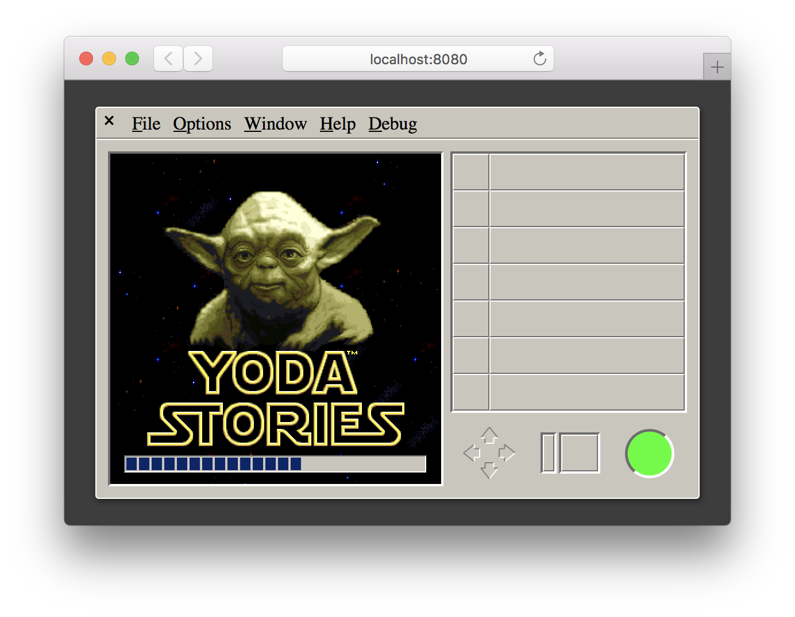
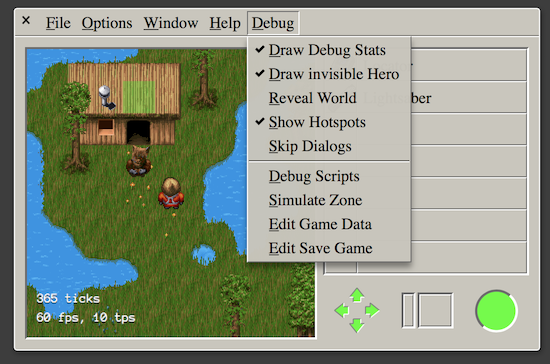
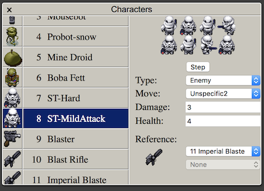
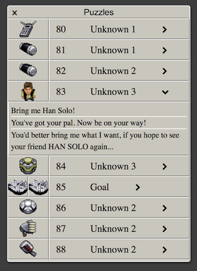

# WebFun

An unfinished web based reimplementation of the desktop adventures game engine.

### similar efforts

-   https://github.com/shinyquagsire23/DesktopAdventures - reimplementation in c
-   https://github.com/IceReaper/DesktopAdventuresToolkit - packer / unpacker for game files
-   https://github.com/digitall/scummvm-deskadv - reimplementation for use in ScummVM

## Usage

### Prerequisites

-   Browser (tested on Safari 11, up to date Chrome should also work)
-   Node.js
-   [yarn](https://yarnpkg.com)
-   game file placed in `assets/game-data` (rename `YODESK.DTA` to `yoda.data`)

### How to build

The project uses yarn to manage dependencies, webpack as a build system and karma/jasmine to run tests.
To compile the project and start a local webserver run the following command:

```bash
# check out project
git clone https://github.com/cyco/WebFun.git
cd WebFun

# install dependencies
yarn

# start local web server, then navigate to http://localhost:8080
yarn start

# run tests
yarn test:full
```

Check the `scripts` section of `package.json` for other commands.

## Screenshots

### Loading Screen



### In-Game view with active debug overlays



### Save Game Inspector


### Character view of resource editor



### Puzzle view of resource editor



### Zone & action editor


