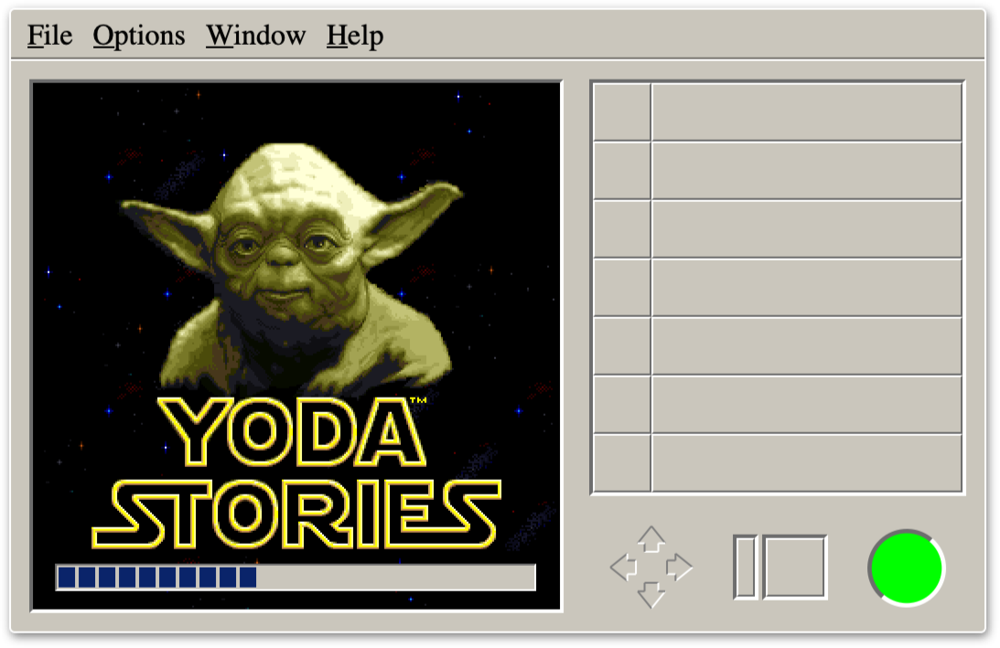
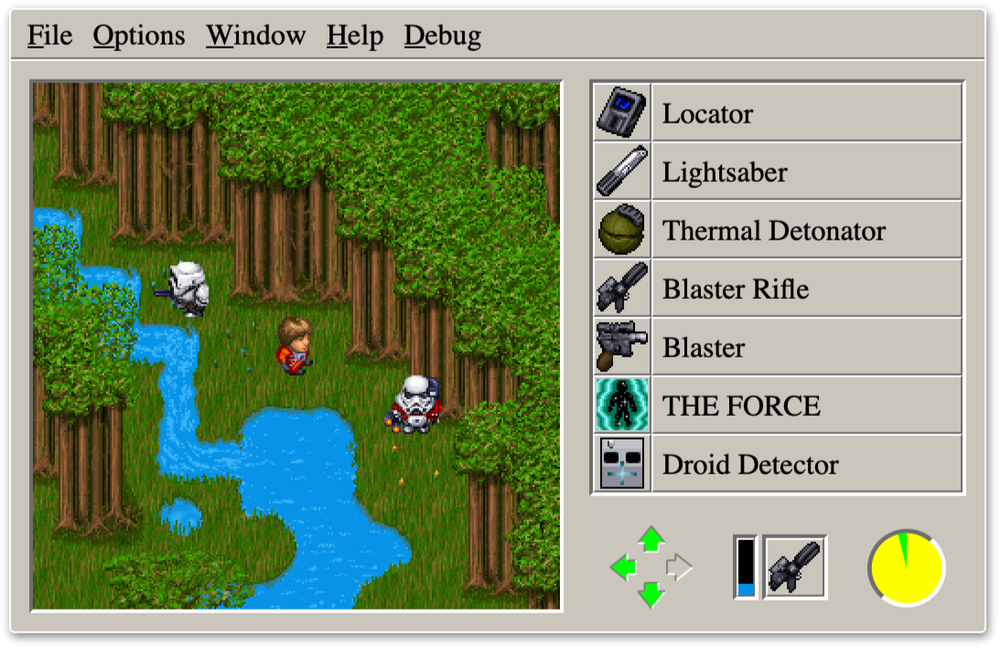
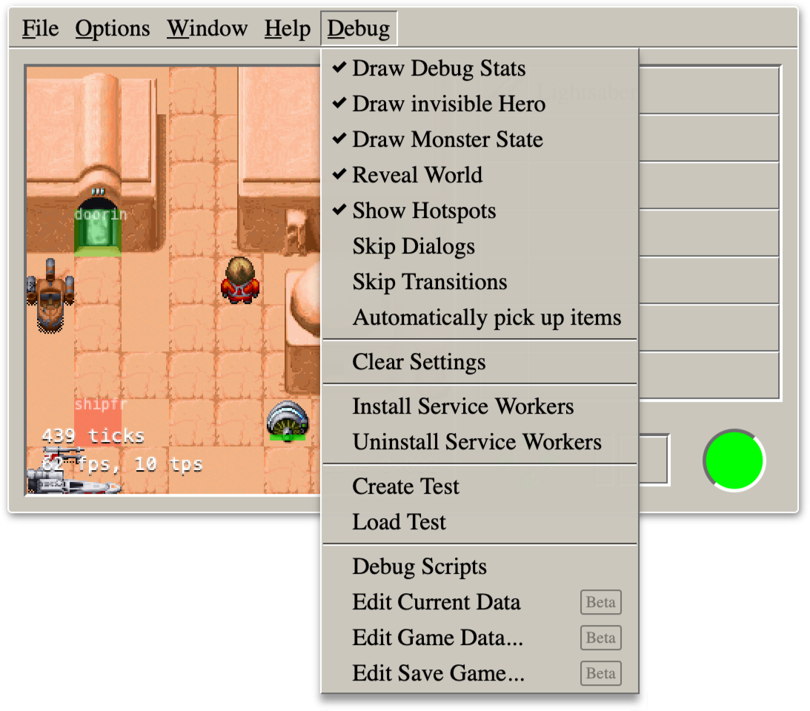
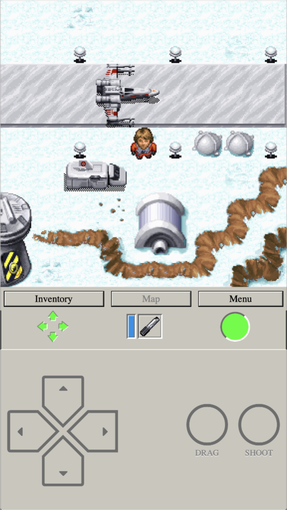
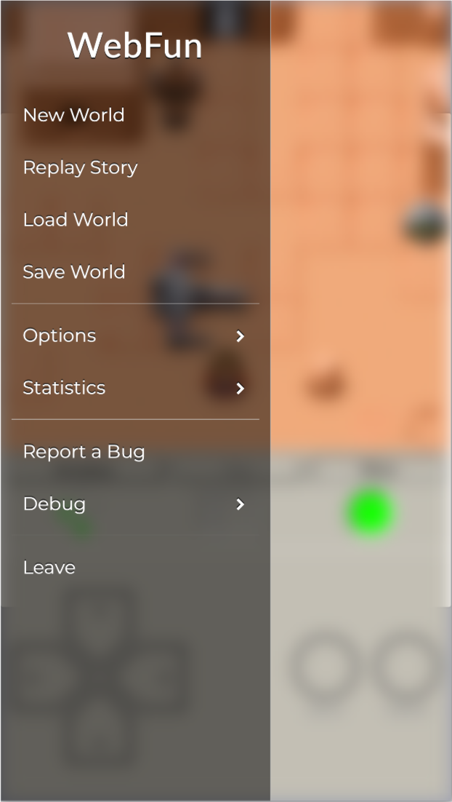
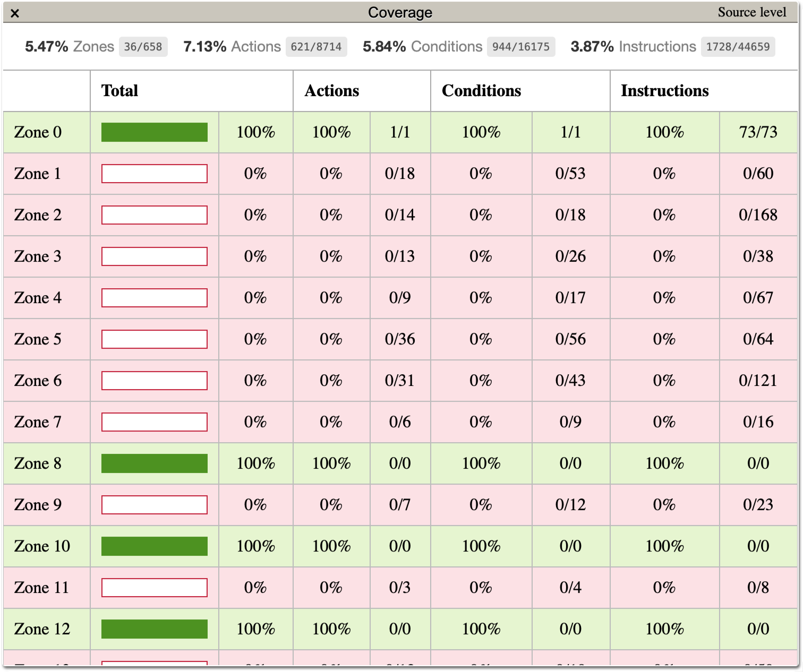

WebFun
======

A reimplementation of the game engine powering *Indiana Jones and His Desktop Adventures* and *Yoda Stories*.

#### See it live at [www.webfun.io](https://www.webfun.io/)

Quick Start
-----------

Make sure you have `node` and `yarn` installed. Then run the following steps in your favorite terminal.

```bash
# check out the code
$ git clone https://github.com/cyco/webfun
$ cd webfun

# install dependencies
$ yarn install

# start a local web server
$ yarn start
```

See the [Getting Started](https://www.webfun.io/docs/architecture/getting-started.html) section in the docs to learn more information about the build system.

Similar Efforts
---------------

-	[shinyquagsire23/DesktopAdventures](https://github.com/shinyquagsire23/DesktopAdventures) -- reimplementation in c
-	[IceReaper/DesktopAdventuresToolkit](https://github.com/IceReaper/DesktopAdventuresToolkit) -- packer / unpacker for game files
-	[digitall/scummvm-deskadv](https://github.com/digitall/scummvm-deskadv) -- reimplementation for use in ScummVM

Screenshots
-----------

Here are some screenshots in case you just want to know what it looks likes.

#### Screenshot of the main window loading assets from archive.org



#### A fierce fight breaks out in a forest, after our hero steals a very valuable *Droid Detector*



#### The main window with active debug overlays and an overview of the debug menu



#### The reimplementation features a mobile view for devices without mouse and keyboard



#### In mobile mode the main menu slides in from the left



#### Screenshot of the save game inspector


#### Inspecting a tile in the asset editor


#### List of characters in the asset editor


#### The zone editor can be used to program actions in a lisp-like language


#### Code coverage repport for in-game scripts


